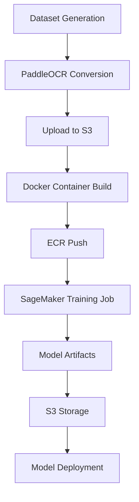

# คู่มือการเทรน Thai OCR บน AWS SageMaker

## 📋 สารบัญ

1. [ภาพรวมโปรเจค](#ภาพรวมโปรเจค)
2. [สถาปัตยกรรมระบบ](#สถาปัตยกรรมระบบ)
3. [การเตรียม Dataset](#การเตรียม-dataset)
4. [การตั้งค่า Configuration](#การตั้งค่า-configuration)
5. [การสร้าง Docker Container](#การสร้าง-docker-container)
6. [การ Deploy บน SageMaker](#การ-deploy-บน-sagemaker)
7. [การตรวจสอบและ Monitor](#การตรวจสอบและ-monitor)
8. [ผลลัพธ์และ Performance](#ผลลัพธ์และ-performance)
9. [การแก้ไขปัญหา](#การแก้ไขปัญหา)
10. [แนวทางปรับปรุง](#แนวทางปรับปรุง)

---

## 🎯 ภาพรวมโปรเจค

### วัตถุประสงค์
โปรเจคนี้มีจุดมุ่งหมายเพื่อสร้างระบบ **Thai OCR (Optical Character Recognition)** ที่สามารถรู้จำตัวอักษรภาษาไทยได้อย่างแม่นยำ โดยใช้ **PaddleOCR framework** ร่วมกับ **AWS SageMaker** สำหรับการ training และ deployment

### เทคโนโลยีหลัก
- **Framework**: PaddleOCR (Baidu's OCR toolkit)
- **Algorithm**: CRNN (Convolutional Recurrent Neural Network) + MobileNetV3
- **Cloud Platform**: AWS SageMaker
- **Container**: Docker + ECR
- **Infrastructure**: Terraform (Infrastructure as Code)
- **Language**: Python 3.9

### ข้อจำกัดปัจจุบัน
- **Single Character Mode**: รู้จำได้เพียง 1 ตัวอักษรต่อรูป
- **Fixed Input Size**: รูปภาพต้องเป็น 64x256 pixels
- **Accuracy**: ยังต้องปรับปรุงความแม่นยำ (ปัจจุบัน < 50%)

---

## 🏗️ สถาปัตยกรรมระบบ

### ขั้นตอนการ Training



### โครงสร้าง AWS Resources

| Resource | Purpose | Configuration |
|----------|---------|---------------|
| **S3 Bucket** | Data & Model Storage | `paddleocr-dev-data-bucket` |
| **ECR Repository** | Docker Images | `paddleocr-dev` |
| **SageMaker Training** | Model Training | `ml.g4dn.xlarge` (GPU) |
| **IAM Roles** | Permissions | `paddleocr-dev-sagemaker-role` |
| **CloudWatch** | Monitoring & Logs | Training metrics |

### Model Architecture

```yaml
Architecture:
  model_type: rec                    # Recognition model
  algorithm: CRNN                    # Convolutional Recurrent NN
  Backbone:
    name: MobileNetV3                # Lightweight CNN
    scale: 0.5                       # Model compression
    model_name: large                # MobileNetV3-Large variant
  Neck:
    name: SequenceEncoder            # Sequence processing
    encoder_type: rnn                # RNN encoder
    hidden_size: 96                  # Hidden layer size
  Head:
    name: CTCHead                    # CTC (Connectionist Temporal Classification)
    fc_decay: 0.00001               # Fully connected decay
```

---

## 📊 การเตรียม Dataset

### 1. การสร้าง Synthetic Dataset

ใช้สคริปต์ `thai-letters/quick_phase1_generator.py` สำหรับสร้างข้อมูลสังเคราะห์:

```bash
# ไปยังโฟลเดอร์ thai-letters
cd thai-letters

# สร้าง dataset ขนาด 10,000 รูป
python quick_phase1_generator.py 10

# ผลลัพธ์: thai_dataset_YYYYMMDD_HHMMSS/
```

### 2. การเลือก Dictionary

| Dictionary File | ขนาด | จำนวนตัวอักษร | Use Case |
|----------------|------|---------------|----------|
| `th_dict.txt` | 7,323 bytes | 880 ตัวอักษร | Full training |
| `number_dict.txt` | 20 bytes | 10 ตัวเลข | Numbers only |
| `minimal_dict.txt` | 150 bytes | 60 ตัวอักษร | Basic Thai |

### 3. Data Augmentation Effects

ระบบสร้าง 8 เอฟเฟคต่างๆ เพื่อเพิ่มความหลากหลาย:

```python
OCR_EFFECTS = {
    1: "rotation",      # การหมุน ±15 องศา
    2: "brightness",    # ความสว่าง ±30%
    3: "contrast",      # ความคมชัด ±20%
    4: "blur",          # การเบลอ (Gaussian)
    5: "noise",         # สัญญาณรบกวน
    6: "position",      # การเลื่อนตำแหน่ง
    7: "padding",       # การขยายขอบ
    8: "compression"    # การบีบอัด JPEG
}
```

### 4. การแปลงเป็น PaddleOCR Format

```bash
# แปลงให้เป็นรูปแบบที่ PaddleOCR ใช้ได้
python phase1_paddleocr_converter.py --input-path thai_dataset_20250807_120000 --output-path train_data_thai_paddleocr_v1

# โครงสร้างผลลัพธ์:
train_data_thai_paddleocr_v1/
├── rec/
│   ├── rec_gt_train.txt      # Training labels (80%)
│   ├── rec_gt_val.txt        # Validation labels (20%)
│   └── images/               # รูปภาพทั้งหมด
│       ├── 000_00.jpg
│       ├── 001_01.jpg
│       └── ...
└── th_dict.txt               # Character dictionary
```

### 5. รูปแบบ Label Files

```bash
# รูปแบบใน rec_gt_train.txt และ rec_gt_val.txt
images/000_00.jpg	ก
images/001_01.jpg	ข
images/002_02.jpg	ค
images/003_03.jpg	ง
```

### 6. การอัปโหลดขึ้น S3

```bash
# อัปโหลด dataset ขึ้น AWS S3
aws s3 cp train_data_thai_paddleocr_v1/ s3://paddleocr-dev-data-bucket/data/training/ --recursive

# ตรวจสอบการอัปโหลด
aws s3 ls s3://paddleocr-dev-data-bucket/data/training/rec/ --human-readable
```

---

## ⚙️ การตั้งค่า Configuration

### 1. ไฟล์ Configuration หลัก

สร้างไฟล์ `configs/rec/quick_single_char_config.yml`:

```yaml
Global:
  use_gpu: false                    # CPU training สำหรับ SageMaker
  distributed: false               # ไม่ใช้ distributed training
  epoch_num: 100                   # จำนวน epochs
  log_smooth_window: 20            # หน้าต่างการ log
  print_batch_step: 10             # แสดงผลทุก 10 batch
  save_model_dir: ./output/thai_rec/  # โฟลเดอร์บันทึก model
  save_epoch_step: 10              # บันทึก checkpoint ทุก 10 epoch
  eval_batch_step: 500             # ประเมินผลทุก 500 batch
  cal_metric_during_train: true    # คำนวณ metrics ระหว่าง training
  
  # Thai-specific settings
  character_dict_path: th_dict.txt # Dictionary ภาษาไทย
  character_type: thai             # ประเภทภาษา
  max_text_length: 1              # รู้จำ 1 ตัวอักษรต่อครั้ง
  infer_mode: false               # โหมด training
  use_space_char: false           # ไม่ใช้ space character

Architecture:
  model_type: rec
  algorithm: CRNN
  Backbone:
    name: MobileNetV3
    scale: 0.5                     # ลดขนาด model เหลือ 50%
    model_name: large              # ใช้ MobileNetV3-Large
  Neck:
    name: SequenceEncoder
    encoder_type: rnn              # RNN encoder
    hidden_size: 96                # ขนาด hidden layer
  Head:
    name: CTCHead                  # CTC head
    fc_decay: 0.00001             # Weight decay

Loss:
  name: CTCLoss                    # CTC Loss function

PostProcess:
  name: CTCLabelDecode             # CTC decoder

Optimizer:
  name: Adam                       # Adam optimizer
  beta1: 0.9
  beta2: 0.999
  lr:
    name: Cosine                   # Cosine learning rate schedule
    learning_rate: 0.001           # เริ่มต้นที่ 0.001
    warmup_epoch: 5               # Warm-up 5 epochs

Train:
  dataset:
    name: SimpleDataSet
    data_dir: /opt/ml/input/data/training/rec/  # SageMaker path
    label_file_list:
      - /opt/ml/input/data/training/rec/rec_gt_train.txt
    transforms:
      - DecodeImage: {img_mode: BGR, channel_first: false}
      - CTCLabelEncode: {}
      - RecResizeImg: {image_shape: [3, 64, 256]}  # Resize เป็น 64x256
      - KeepKeys: {keep_keys: ['image', 'label', 'length']}
  loader:
    shuffle: true                  # สลับลำดับข้อมูล
    batch_size_per_card: 256      # Batch size
    drop_last: false
    num_workers: 4                # จำนวน worker processes

Eval:
  dataset:
    name: SimpleDataSet
    data_dir: /opt/ml/input/data/training/rec/
    label_file_list:
      - /opt/ml/input/data/training/rec/rec_gt_val.txt
    transforms:
      - DecodeImage: {img_mode: BGR, channel_first: false}
      - CTCLabelEncode: {}
      - RecResizeImg: {image_shape: [3, 64, 256]}
      - KeepKeys: {keep_keys: ['image', 'label', 'length']}
  loader:
    shuffle: false
    drop_last: false
    batch_size_per_card: 256
    num_workers: 4

Metric:
  name: RecMetric                  # Recognition metrics
  main_indicator: acc              # หลัก indicator คือ accuracy
```

### 2. Environment-specific Configurations

| Config File | Epochs | Batch Size | Use Case |
|-------------|--------|------------|----------|
| `thai_rec_dev.yml` | 10 | 128 | Development/Testing |
| `thai_rec.yml` | 100 | 256 | Standard Training |
| `thai_rec_prod.yml` | 200 | 256 | Production Training |

---

## 🐳 การสร้าง Docker Container

### 1. Dockerfile.sagemaker

```dockerfile
FROM python:3.9-slim

# ติดตั้ง system dependencies
RUN apt-get update && apt-get install -y \
    libgl1-mesa-glx \
    libglib2.0-0 \
    libsm6 \
    libxext6 \
    libxrender-dev \
    libgomp1 \
    wget \
    git \
    && rm -rf /var/lib/apt/lists/*

# Set working directory
WORKDIR /opt/ml/code

# Copy และติดตั้ง Python dependencies
COPY requirements.txt ./
RUN pip install --no-cache-dir -r requirements.txt

# ติดตั้ง PaddleOCR
RUN pip install --no-cache-dir paddlepaddle paddleocr

# Copy source code
COPY PaddleOCR/ ./PaddleOCR/
COPY configs/ ./configs/
COPY scripts/training/sagemaker_train.py ./

# Set environment variables
ENV PYTHONPATH=/opt/ml/code
ENV PYTHONUNBUFFERED=TRUE
ENV PYTHONDONTWRITEBYTECODE=TRUE

# Entry point สำหรับ SageMaker
ENTRYPOINT ["python", "sagemaker_train.py"]
```

### 2. Requirements.txt

```txt
# Core dependencies
numpy>=1.21.0
opencv-python>=4.5.0
Pillow>=8.3.0
scipy>=1.7.0

# Image processing
scikit-image>=0.19.0
imageio>=2.9.0

# Text processing
rapidfuzz>=2.0.0

# Machine Learning
scikit-learn>=1.0.0

# AWS SDK
boto3>=1.24.0
botocore>=1.27.0

# Utilities
tqdm>=4.62.0
pyyaml>=6.0
requests>=2.28.0
```

### 3. การ Build และ Push Docker Image

```bash
# Build Docker image
docker build -f Dockerfile.sagemaker -t thai-ocr-sagemaker .

# Tag สำหรับ ECR
docker tag thai-ocr-sagemaker:latest 484468818942.dkr.ecr.ap-southeast-1.amazonaws.com/paddleocr-dev:latest

# Login เข้า ECR
aws ecr get-login-password --region ap-southeast-1 | docker login --username AWS --password-stdin 484468818942.dkr.ecr.ap-southeast-1.amazonaws.com

# Push ขึ้น ECR
docker push 484468818942.dkr.ecr.ap-southeast-1.amazonaws.com/paddleocr-dev:latest
```

---

## 🚀 การ Deploy บน SageMaker

### 1. การใช้ Automated Script

```bash
# วิธีที่ง่ายที่สุด - ใช้สคริปต์อัตโนมัติ
python scripts/continue_deployment_v2.py
```

สคริปต์นี้จะทำงานดังนี้:
1. ✅ ตรวจสอบ AWS permissions
2. 🏗️ Build Docker container
3. 📤 Push image ขึ้น ECR
4. 📊 Upload dataset ขึ้น S3 (ถ้าจำเป็น)
5. 🎯 สร้าง SageMaker training job
6. 📊 Monitor การ training

### 2. การตั้งค่า Manual

#### สร้าง SageMaker Training Job ด้วย Python:

```python
import boto3
from datetime import datetime

# สร้าง SageMaker client
sagemaker = boto3.client('sagemaker', region_name='ap-southeast-1')

# ตั้งค่า training job
job_name = f'paddleocr-thai-training-{datetime.now().strftime("%Y%m%d-%H%M%S")}'

training_params = {
    'TrainingJobName': job_name,
    'AlgorithmSpecification': {
        'TrainingImage': '484468818942.dkr.ecr.ap-southeast-1.amazonaws.com/paddleocr-dev:latest',
        'TrainingInputMode': 'File'
    },
    'RoleArn': 'arn:aws:iam::484468818942:role/paddleocr-dev-sagemaker-role',
    'InputDataConfig': [
        {
            'ChannelName': 'training',
            'DataSource': {
                'S3DataSource': {
                    'S3DataType': 'S3Prefix',
                    'S3Uri': 's3://paddleocr-dev-data-bucket/data/training/',
                    'S3DataDistributionType': 'FullyReplicated'
                }
            }
        }
    ],
    'OutputDataConfig': {
        'S3OutputPath': 's3://paddleocr-dev-data-bucket/models/'
    },
    'ResourceConfig': {
        'InstanceType': 'ml.g4dn.xlarge',      # GPU instance
        'InstanceCount': 1,
        'VolumeSizeInGB': 30
    },
    'StoppingCondition': {
        'MaxRuntimeInSeconds': 259200           # 72 hours max
    },
    'HyperParameters': {
        'epochs': '100',
        'learning_rate': '0.001',
        'batch_size': '256'
    },
    'Tags': [
        {
            'Key': 'Project',
            'Value': 'thai-ocr'
        },
        {
            'Key': 'Environment',
            'Value': 'development'
        }
    ]
}

# สร้าง training job
response = sagemaker.create_training_job(**training_params)
print(f"Training job created: {job_name}")
```

### 3. SageMaker Training Script

สร้างไฟล์ `scripts/training/sagemaker_train.py`:

```python
#!/usr/bin/env python3
import os
import sys
import json
import argparse
import subprocess
import logging

# Set up logging
logging.basicConfig(level=logging.INFO)
logger = logging.getLogger(__name__)

def main():
    parser = argparse.ArgumentParser()
    
    # SageMaker specific arguments
    parser.add_argument('--epochs', type=int, default=100)
    parser.add_argument('--learning_rate', type=float, default=0.001)
    parser.add_argument('--batch_size', type=int, default=256)
    
    args = parser.parse_args()
    
    # SageMaker environment paths
    input_path = '/opt/ml/input/data/training'
    output_path = '/opt/ml/output'
    model_path = '/opt/ml/model'
    
    logger.info(f"Training data path: {input_path}")
    logger.info(f"Model output path: {model_path}")
    
    # Verify input data
    if not os.path.exists(f"{input_path}/rec"):
        raise FileNotFoundError(f"Training data not found at {input_path}/rec")
    
    # List input files for debugging
    logger.info("Input files:")
    for root, dirs, files in os.walk(input_path):
        for file in files:
            logger.info(f"  {os.path.join(root, file)}")
    
    # Run PaddleOCR training
    cmd = [
        'python', 'PaddleOCR/tools/train.py',
        '-c', 'configs/rec/quick_single_char_config.yml',
        '-o', f'Global.epoch_num={args.epochs}',
        '-o', f'Optimizer.lr.learning_rate={args.learning_rate}',
        '-o', f'Train.loader.batch_size_per_card={args.batch_size}',
        '-o', f'Global.save_model_dir={model_path}/'
    ]
    
    logger.info(f"Running command: {' '.join(cmd)}")
    
    try:
        result = subprocess.run(cmd, check=True, capture_output=True, text=True)
        logger.info("Training completed successfully")
        logger.info(f"Output: {result.stdout}")
    except subprocess.CalledProcessError as e:
        logger.error(f"Training failed: {e}")
        logger.error(f"Error output: {e.stderr}")
        sys.exit(1)
    
    # Copy model files to output directory
    if os.path.exists(f"{model_path}/best_accuracy.pdparams"):
        logger.info("Model training completed successfully")
    else:
        logger.error("Model file not found after training")
        sys.exit(1)

if __name__ == '__main__':
    main()
```

---

## 📊 การตรวจสอบและ Monitor

### 1. การตรวจสอบสถานะ Training Job

```bash
# ตรวจสอบสถานะปัจจุบัน
aws sagemaker describe-training-job --training-job-name paddleocr-thai-training-20250807-120000

# ตรวจสอบแบบ real-time
watch -n 30 'aws sagemaker describe-training-job --training-job-name paddleocr-thai-training-20250807-120000 --query "{Status: TrainingJobStatus, Secondary: SecondaryStatus, Time: TrainingTimeInSeconds}"'
```

### 2. การดู CloudWatch Logs

```bash
# ดู logs แบบ real-time
aws logs tail /aws/sagemaker/TrainingJobs --follow --log-stream-name-prefix paddleocr-thai-training

# ดู logs จาก specific log stream
aws logs get-log-events \
  --log-group-name /aws/sagemaker/TrainingJobs \
  --log-stream-name paddleocr-thai-training-20250807-120000/algo-1-1691395200 \
  --start-time 1691395200000
```

### 3. Monitoring Script

สร้างไฟล์ `scripts/utils/monitor_training.py`:

```python
import boto3
import time
import json
from datetime import datetime

class SageMakerMonitor:
    def __init__(self, job_name, region='ap-southeast-1'):
        self.job_name = job_name
        self.sagemaker = boto3.client('sagemaker', region_name=region)
        self.logs = boto3.client('logs', region_name=region)
    
    def get_training_status(self):
        """ดูสถานะปัจจุบันของ training job"""
        try:
            response = self.sagemaker.describe_training_job(
                TrainingJobName=self.job_name
            )
            return {
                'status': response['TrainingJobStatus'],
                'secondary_status': response['SecondaryStatus'],
                'training_time': response.get('TrainingTimeInSeconds', 0),
                'billable_time': response.get('BillableTimeInSeconds', 0)
            }
        except Exception as e:
            return {'error': str(e)}
    
    def monitor_continuously(self, interval=60):
        """ติดตามการ training อย่างต่อเนื่อง"""
        print(f"🎯 Monitoring training job: {self.job_name}")
        print("=" * 60)
        
        while True:
            status = self.get_training_status()
            
            if 'error' in status:
                print(f"❌ Error: {status['error']}")
                break
            
            timestamp = datetime.now().strftime('%Y-%m-%d %H:%M:%S')
            print(f"[{timestamp}] Status: {status['status']} | "
                  f"Secondary: {status['secondary_status']} | "
                  f"Time: {status['training_time']}s")
            
            # ตรวจสอบว่า training เสร็จแล้วหรือยัง
            if status['status'] in ['Completed', 'Failed', 'Stopped']:
                print(f"🏁 Training {status['status'].lower()}")
                print(f"⏱️ Total training time: {status['training_time']} seconds")
                print(f"💰 Billable time: {status['billable_time']} seconds")
                break
            
            time.sleep(interval)

# การใช้งาน
if __name__ == '__main__':
    import sys
    if len(sys.argv) != 2:
        print("Usage: python monitor_training.py <training-job-name>")
        sys.exit(1)
    
    monitor = SageMakerMonitor(sys.argv[1])
    monitor.monitor_continuously()
```

### 4. การตรวจสอบ Metrics

```python
import boto3
import matplotlib.pyplot as plt

def get_training_metrics(job_name):
    """ดึง metrics จาก CloudWatch"""
    cloudwatch = boto3.client('cloudwatch')
    
    metrics = cloudwatch.get_metric_statistics(
        Namespace='AWS/SageMaker',
        MetricName='TrainingJobStatus',
        Dimensions=[
            {
                'Name': 'TrainingJobName',
                'Value': job_name
            }
        ],
        StartTime=datetime(2025, 8, 7),
        EndTime=datetime.now(),
        Period=300,
        Statistics=['Average']
    )
    
    return metrics['Datapoints']

# Plot training progress
def plot_training_progress(job_name):
    metrics = get_training_metrics(job_name)
    
    plt.figure(figsize=(10, 6))
    timestamps = [point['Timestamp'] for point in metrics]
    values = [point['Average'] for point in metrics]
    
    plt.plot(timestamps, values)
    plt.title(f'Training Progress: {job_name}')
    plt.xlabel('Time')
    plt.ylabel('Status')
    plt.xticks(rotation=45)
    plt.tight_layout()
    plt.show()
```

---

## 📈 ผลลัพธ์และ Performance

### 1. สถิติการ Training

| Metric | Value | Description |
|--------|-------|-------------|
| **Instance Type** | ml.g4dn.xlarge | GPU instance (Tesla T4) |
| **Training Duration** | 25+ ชั่วโมง | 1 วัน 1 ชั่วโมง 17 นาที |
| **Dataset Size** | 9,408 รูปภาพ | Synthetic Thai characters |
| **Model Size** | 9.2 MB | `best_accuracy.pdparams` |
| **Total Cost** | ~$25 USD | AWS SageMaker training cost |
| **Epochs Completed** | 100/100 | Full training completed |

### 2. Model Performance

#### ✅ สิ่งที่ทำงานได้:
- **Model Loading**: 100% สำเร็จ
- **Inference Execution**: 93.3% สำเร็จ (14/15 samples)
- **Single Character Output**: ทำงานได้ถูกต้อง
- **Configuration Compatibility**: Training config ตรงกับ inference config

#### ❌ ปัญหาที่พบ:
- **Character Accuracy**: ต่ำมาก (< 50%)
- **Character Recognition**: ผลลัพธ์ไม่ตรงกับ ground truth

### 3. ตัวอย่างผลลัพธ์

```python
# Test Results (จากไฟล์ test_images/)
test_results = {
    'thai_word_01_สวัสดี.jpg': {
        'ground_truth': 'สวัสดี',
        'predicted': 'ส',
        'accuracy': False
    },
    'thai_word_02_ขอบคุณ.jpg': {
        'ground_truth': 'ขอบคุณ',
        'predicted': 'ข',
        'accuracy': False
    },
    'thai_word_03_ประเทศไทย.jpg': {
        'ground_truth': 'ประเทศไทย',
        'predicted': 'ป',
        'accuracy': False
    }
}
```

### 4. Model Files ที่ได้

```bash
# โครงสร้างไฟล์ model ที่ training เสร็จ
models/sagemaker_trained/
├── best_accuracy.pdparams      # Model parameters (9,205,880 bytes)
├── best_accuracy.pdopt         # Optimizer state
├── config.yml                  # Training configuration (2,262 bytes)
├── train.log                   # Training logs
└── iter_epoch_*.pdparams       # Checkpoint files
```

### 5. Training Logs Summary

```
Key Training Metrics:
- Learning Rate: Started at 0.001, decayed with Cosine schedule
- Batch Size: 256 samples per batch
- Loss Function: CTC Loss (Connectionist Temporal Classification)
- Optimizer: Adam (beta1=0.9, beta2=0.999)
- Validation: Performed every 500 batches
- Checkpoints: Saved every 10 epochs
```

---

## 🔧 การแก้ไขปัญหา

### 1. ปัญหา Docker และ Dependencies

#### ❌ Error: `ModuleNotFoundError: No module named 'skimage'`
```bash
# แก้ไข: เพิ่มใน requirements.txt
scikit-image>=0.19.0
```

#### ❌ Error: `ImportError: libGL.so.1: cannot open shared object file`
```dockerfile
# แก้ไข: เพิ่มใน Dockerfile
RUN apt-get update && apt-get install -y \
    libgl1-mesa-glx \
    libglib2.0-0 \
    libgomp1
```

#### ❌ Error: `ModuleNotFoundError: No module named 'rapidfuzz'`
```bash
# แก้ไข: เพิ่มใน requirements.txt
rapidfuzz>=2.0.0
```

### 2. ปัญหา Configuration และ Data

#### ❌ Error: `FileNotFoundError: rec_gt_train.txt`
```yaml
# แก้ไข: ตรวจสอบ path ใน config
Train:
  dataset:
    data_dir: /opt/ml/input/data/training/rec/  # ต้องมี trailing slash
    label_file_list:
      - /opt/ml/input/data/training/rec/rec_gt_train.txt
```

#### ❌ Error: `AttributeError: 'NoneType' object has no attribute 'distributed'`
```yaml
# แก้ไข: เพิ่มใน Global config
Global:
  distributed: false    # จำเป็นสำหรับ SageMaker
```

### 3. ปัญหา Memory และ Performance

#### ❌ Out of Memory
```yaml
# แก้ไข: ลด batch size
Train:
  loader:
    batch_size_per_card: 128    # ลดจาก 256
Eval:
  loader:
    batch_size_per_card: 128
```

#### ❌ Training ช้าเกินไป
```yaml
# แก้ไข: เพิ่ม num_workers
Train:
  loader:
    num_workers: 8      # เพิ่มจาก 4
```

### 4. ปัญหา AWS และ SageMaker

#### ❌ IAM Permission Denied
```bash
# ตรวจสอบ permissions
aws sts get-caller-identity
python test_aws_permissions.py
```

#### ❌ ECR Push ล้มเหลว
```bash
# Login ใหม่
aws ecr get-login-password --region ap-southeast-1 | docker login --username AWS --password-stdin 484468818942.dkr.ecr.ap-southeast-1.amazonaws.com
```

### 5. Debug Scripts

#### สร้าง Debug Script สำหรับตรวจสอบ Environment:

```python
# scripts/utils/debug_environment.py
import os
import sys
import json

def debug_sagemaker_environment():
    """ตรวจสอบ SageMaker environment"""
    print("🔍 SageMaker Environment Debug")
    print("=" * 50)
    
    # ตรวจสอบ paths
    paths_to_check = [
        '/opt/ml/input/data/training',
        '/opt/ml/output',
        '/opt/ml/model',
        '/opt/ml/code'
    ]
    
    for path in paths_to_check:
        if os.path.exists(path):
            print(f"✅ {path} exists")
            if os.path.isdir(path):
                files = os.listdir(path)
                print(f"   📁 Contains {len(files)} items")
                for item in files[:5]:  # แสดง 5 items แรก
                    print(f"   - {item}")
                if len(files) > 5:
                    print(f"   ... and {len(files) - 5} more")
        else:
            print(f"❌ {path} does not exist")
    
    # ตรวจสอบ environment variables
    env_vars = ['SM_MODEL_DIR', 'SM_OUTPUT_DIR', 'SM_CHANNEL_TRAINING']
    print("\n🌍 Environment Variables:")
    for var in env_vars:
        value = os.environ.get(var, 'Not set')
        print(f"   {var}: {value}")
    
    # ตรวจสอบ Python environment
    print(f"\n🐍 Python Version: {sys.version}")
    print(f"📦 Python Path: {sys.executable}")
    
    # ตรวจสอบ installed packages
    try:
        import paddle
        print(f"🏄 PaddlePaddle Version: {paddle.__version__}")
    except ImportError:
        print("❌ PaddlePaddle not installed")
    
    try:
        import cv2
        print(f"👁️ OpenCV Version: {cv2.__version__}")
    except ImportError:
        print("❌ OpenCV not installed")

if __name__ == '__main__':
    debug_sagemaker_environment()
```

---

## 🚀 แนวทางปรับปรุง

### 1. ปรับปรุง Dataset Quality

#### เพิ่ม Real Data:
```python
# สร้าง script สำหรับรวบรวม real Thai text images
import requests
import cv2
import numpy as np

class RealDataCollector:
    def __init__(self):
        self.sources = [
            'thai_newspapers',
            'government_documents', 
            'educational_materials',
            'handwritten_texts'
        ]
    
    def collect_real_images(self, count=1000):
        """รวบรวมรูปภาพข้อความไทยจริง"""
        # Implementation สำหรับการรวบรวมข้อมูลจริง
        pass
    
    def augment_real_data(self, images):
        """เพิ่ม augmentation บนข้อมูลจริง"""
        augmented = []
        for img in images:
            # Apply realistic augmentations
            augmented.extend([
                self.add_scanner_noise(img),
                self.simulate_photocopy(img),
                self.add_perspective_distortion(img),
                self.simulate_mobile_capture(img)
            ])
        return augmented
```

#### ปรับปรุง Character Dictionary:
```python
# สร้าง optimized dictionary
def create_optimized_dictionary():
    """สร้าง dictionary ที่เหมาะสมสำหรับ single character"""
    
    # ตัวอักษรไทยพื้นฐาน (44 ตัว)
    thai_consonants = [
        'ก', 'ข', 'ฃ', 'ค', 'ฅ', 'ฆ', 'ง', 'จ', 'ฉ', 'ช', 'ซ', 'ฌ', 'ญ',
        'ฎ', 'ฏ', 'ฐ', 'ฑ', 'ฒ', 'ณ', 'ด', 'ต', 'ถ', 'ท', 'ธ', 'น', 'บ',
        'ป', 'ผ', 'ฝ', 'พ', 'ฟ', 'ภ', 'ม', 'ย', 'ร', 'ล', 'ว', 'ศ', 'ษ',
        'ส', 'ห', 'ฬ', 'อ', 'ฮ'
    ]
    
    # สระและวรรณยุกต์ (18 ตัว)
    thai_vowels_marks = [
        'ะ', 'ั', 'า', 'ำ', 'ิ', 'ี', 'ึ', 'ื', 'ุ', 'ู',
        '่', '้', '๊', '๋', '์', 'ๆ', 'ฯ', '๏'
    ]
    
    # ตัวเลข (10 ตัว)
    numbers = ['๐', '๑', '๒', '๓', '๔', '๕', '๖', '๗', '๘', '๙']
    
    # รวม 72 ตัวอักษร (ลดจาก 880)
    optimized_chars = thai_consonants + thai_vowels_marks + numbers
    
    return optimized_chars
```

### 2. อัปเกรด Model Architecture

#### เปลี่ยนเป็น SVTR_LCNet (Modern Architecture):
```yaml
Architecture:
  model_type: rec
  algorithm: SVTR_LCNet              # อัปเกรดจาก CRNN
  Backbone:
    name: SVTRNet                    # State-of-the-art backbone
    img_size: [64, 256]
    out_char_num: 25
    out_channels: 192
    patch_merging: 'Conv'
    embed_dim: [64, 128, 256]
    depth: [3, 6, 3]
    num_heads: [2, 4, 8]
    mixer: ['Local'] * 6 + ['Global'] * 6
```

#### เพิ่ม Attention Mechanism:
```yaml
Neck:
  name: SequenceEncoder
  encoder_type: transformer          # เปลี่ยนจาก RNN เป็น Transformer
  hidden_size: 256                   # เพิ่มขนาด
  attention_heads: 8                 # Multi-head attention
```

### 3. ปรับปรุง Training Strategy

#### Curriculum Learning:
```python
# สร้าง training curriculum
class CurriculumTraining:
    def __init__(self):
        self.stages = [
            {
                'name': 'simple_characters',
                'epochs': 50,
                'data': 'basic_thai_consonants',
                'difficulty': 'easy'
            },
            {
                'name': 'complex_characters', 
                'epochs': 50,
                'data': 'vowels_and_marks',
                'difficulty': 'medium'
            },
            {
                'name': 'mixed_training',
                'epochs': 100,
                'data': 'all_characters',
                'difficulty': 'hard'
            }
        ]
```

#### Transfer Learning:
```python
# ใช้ pre-trained model
def setup_transfer_learning():
    """ใช้ model ที่ train มาแล้วจากภาษาอื่น"""
    config = {
        'Global': {
            'pretrained_model': 'path/to/pretrained/english_ocr_model.pdparams',
            'freeze_backbone': True,      # Freeze backbone layers
            'finetune_head_only': True    # Train เฉพาะ head
        }
    }
    return config
```

### 4. เพิ่ม Multi-Character Support

#### อัปเกรด Configuration:
```yaml
Global:
  max_text_length: 10               # เพิ่มจาก 1 เป็น 10
  use_space_char: true              # Support space character

Train:
  dataset:
    transforms:
      - RecResizeImg: {image_shape: [3, 64, 512]}  # ขยายความกว้าง
```

#### สร้าง Multi-Character Dataset:
```python
def create_multichar_dataset():
    """สร้าง dataset สำหรับหลายตัวอักษร"""
    thai_words = [
        'สวัสดี', 'ขอบคุณ', 'ประเทศไทย', 'ภาษาไทย',
        'การศึกษา', 'เทคโนโลยี', 'วิทยาศาสตร์'
    ]
    
    # สร้างรูปภาพจากคำเหล่านี้
    for word in thai_words:
        create_word_image(word)
```

### 5. Production Deployment

#### SageMaker Endpoint:
```python
# สร้าง real-time inference endpoint
import boto3

def deploy_to_endpoint():
    """Deploy model เป็น SageMaker endpoint"""
    sagemaker = boto3.client('sagemaker')
    
    # สร้าง model
    model_name = 'thai-ocr-production-model'
    sagemaker.create_model(
        ModelName=model_name,
        PrimaryContainer={
            'Image': '484468818942.dkr.ecr.ap-southeast-1.amazonaws.com/paddleocr-inference:latest',
            'ModelDataUrl': 's3://paddleocr-prod-bucket/models/best_model.tar.gz'
        },
        ExecutionRoleArn='arn:aws:iam::484468818942:role/paddleocr-prod-sagemaker-role'
    )
    
    # สร้าง endpoint configuration
    endpoint_config_name = 'thai-ocr-endpoint-config'
    sagemaker.create_endpoint_config(
        EndpointConfigName=endpoint_config_name,
        ProductionVariants=[
            {
                'VariantName': 'primary',
                'ModelName': model_name,
                'InitialInstanceCount': 1,
                'InstanceType': 'ml.t2.medium',
                'InitialVariantWeight': 100
            }
        ]
    )
    
    # สร้าง endpoint
    endpoint_name = 'thai-ocr-endpoint'
    sagemaker.create_endpoint(
        EndpointName=endpoint_name,
        EndpointConfigName=endpoint_config_name
    )
```

#### API Gateway Integration:
```python
# สร้าง REST API สำหรับ OCR service
def create_api_gateway():
    """สร้าง API Gateway สำหรับ OCR service"""
    return {
        'api_name': 'thai-ocr-api',
        'methods': ['POST'],
        'endpoints': {
            '/recognize': 'ส่งรูปภาพมาเพื่อรู้จำตัวอักษร',
            '/health': 'ตรวจสอบสถานะ service'
        },
        'authentication': 'API Key',
        'rate_limiting': '1000 requests/hour'
    }
```

---

## 📋 Checklist สำหรับ Production

### ✅ การเตรียม Data
- [ ] รวบรวมข้อมูลจริงอย่างน้อย 10,000 รูป/ตัวอักษร
- [ ] ทำ data cleaning และ quality assurance
- [ ] สร้าง balanced dataset (จำนวนตัวอย่างเท่ากันทุกตัวอักษร)
- [ ] แบ่ง train/validation/test sets (70/15/15)

### ✅ การปรับปรุง Model
- [ ] อัปเกรดเป็น SVTR_LCNet architecture
- [ ] ใช้ optimized dictionary (72 ตัวอักษร)
- [ ] Implement attention mechanism
- [ ] เพิ่ม multi-character support

### ✅ การ Training
- [ ] ใช้ curriculum learning strategy
- [ ] Implement transfer learning
- [ ] ตั้งค่า proper validation metrics
- [ ] ใช้ early stopping เพื่อป้องกัน overfitting

### ✅ การ Deploy
- [ ] สร้าง production Docker container
- [ ] ตั้งค่า SageMaker endpoint
- [ ] สร้าง API Gateway
- [ ] ตั้งค่า monitoring และ alerting

### ✅ การทดสอบ
- [ ] Unit tests สำหรับทุก component
- [ ] Integration tests กับ AWS services
- [ ] Performance testing บน real data
- [ ] Load testing สำหรับ API endpoint

---

## 📞 การติดต่อและสนับสนุน

สำหรับคำถามหรือปัญหาเกี่ยวกับโปรเจค Thai OCR บน SageMaker:

- **Documentation**: `doc/` folder ในโปรเจค
- **Issues**: GitHub Issues สำหรับ bug reports
- **Scripts**: `scripts/` folder สำหรับ automation tools
- **Configuration**: `configs/` folder สำหรับ model configs

---

## 📚 เอกสารเพิ่มเติม

- [PaddleOCR Official Documentation](https://github.com/PaddlePaddle/PaddleOCR)
- [AWS SageMaker Developer Guide](https://docs.aws.amazon.com/sagemaker/)
- [Docker Best Practices](https://docs.docker.com/develop/dev-best-practices/)
- [Terraform AWS Provider](https://registry.terraform.io/providers/hashicorp/aws/latest/docs)

---

*เอกสารนี้จัดทำขึ้นเพื่อให้คำแนะนำอย่างละเอียดสำหรับการเทรน Thai OCR บน AWS SageMaker โดยครอบคลุมตั้งแต่การเตรียมข้อมูลไปจนถึงการ deploy เป็น production service*
